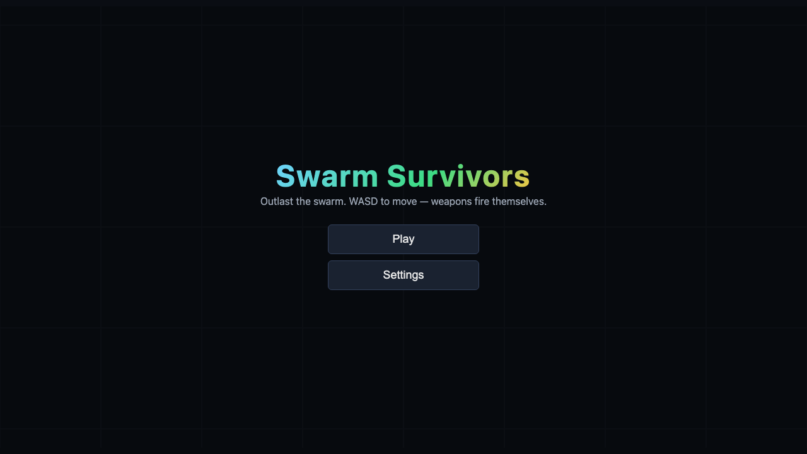
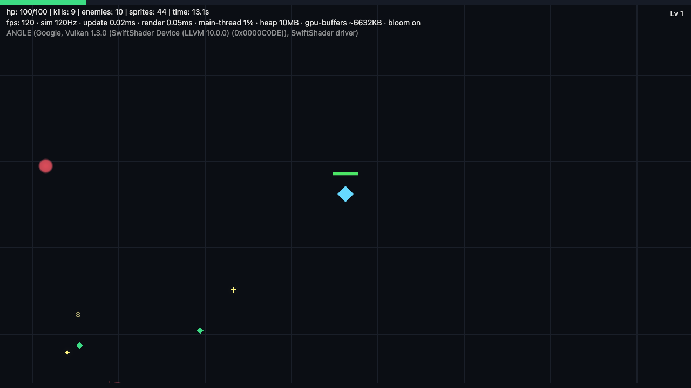

# Swarm Survivors

**Outlast the swarm in this WebGL2 arena roguelike.**

A Vampire Survivors-style horde survival game built with TypeScript + raw WebGL2, made for our computer graphics course. The whole game is a GPU showcase: every sprite drawn in a single instanced draw call, simulation ticking at a fixed 120Hz.

**Play now:** [seyamalam.itch.io/swarm-survivors](https://seyamalam.itch.io/swarm-survivors) (HTML5, runs in browser) — or grab desktop builds for Windows/macOS/Linux.

## Features

- **Single-draw-call rendering** — all sprites batched into one `drawArraysInstanced` call via WebGL2
- **Procedural texture atlas** — shapes + digit font generated at runtime; per-instance UVs and hit-flash in the shader
- **Bloom post-processing** — bright-pass + separable gaussian blur + additive composite (FBO ping-pong)
- **Spatial hash collision** — uniform grid neighbor queries replace O(n²) pairwise checks
- **Object pooling** — enemies, projectiles, gems, particles, damage numbers all recycled (near-zero GC churn)
- **Game feel** — particles, floating damage numbers, screen shake, hit-stop on elite kills
- **Fixed 120Hz simulation** — accumulator-based timestep decoupled from render rate; identical gameplay on any display, with a live FPS counter in the HUD
- **Escalating horde** — 12-wave timeline over 10 minutes, 16 enemy types, Hive Tyrant boss at 10:00
- **Roguelike draft** — level up → pick 1 of 3 cards: new weapon (4 mechanics: projectile/aura/orbit/nova), weapon upgrade, or stat boost
- **Content-as-data** — enemies, weapons, waves are pure JSON in `src/data/`, no engine knowledge needed to add more
- **Zero-dependency game code** — no engine, no framework; TypeScript straight to WebGL2 (~12KB gzipped)
- **Live perf overlay** — fps, update/render ms, main-thread busy %, JS heap, GPU model, GPU buffer footprint. The Electron build additionally shows real CPU% and per-process RAM via `app.getAppMetrics()` (browsers don't expose true CPU/GPU/VRAM counters to web pages)

## Benchmark

`npm run benchmark` stress-tests naive (per-sprite draw calls, O(n²) collision) vs optimized (instancing, spatial hash, pooling) at 500–10,000 enemies and writes `docs/benchmark.md`. The `naive-renderer` branch preserves the pre-optimization code for the grading comparison.

## Screenshots

Refreshed automatically on every commit by the pre-commit hook (`scripts/capture-screenshots.mjs`, headless Playwright against the production build). Skip for one commit with `SKIP_SCREENSHOTS=1 git commit ...`.

| Menu                                    | Gameplay                                   |
| --------------------------------------- | ------------------------------------------ |
|  |  |

## Quick start

```bash
npm install
npm run dev
```

Open the printed local URL. Move with **WASD** or **arrow keys**.

Build for release:

```bash
npm run build     # outputs static site to dist/
npm run preview   # serve the production build locally
```

## Publishing to itch.io

**HTML5 (in-browser play):**

```bash
npm run deploy:itch:web   # builds dist/ and pushes with butler
```

Requires the [butler CLI](https://itch.io/docs/butler/) on PATH and either a prior `butler login` or `BUTLER_API_KEY` in the environment or `.env.local`. Set `ITCH_TARGET=user/page:html5` to override the default target. Every successful local commit is automatically built and pushed to the `html5` channel by the Husky post-commit hook.

Before each commit, Husky formats and lints staged files, then runs the full TypeScript typecheck and ESLint suite. If any check fails, the commit is stopped.

**Desktop downloads (Electron):**

```bash
npm run package:mac     # dmg + zip, x64 and arm64
npm run package:win     # portable exe, x64
npm run package:linux   # AppImage + zip, x64
```

Artifacts land in `release/desktop/`. Upload them to the same itch page as downloadable files (or push with `butler push <file> user/page:osx-arm64` etc.). Note: builds are unsigned — macOS players right-click → Open the first time.

## Development

| Command                         | What it does                                    |
| ------------------------------- | ----------------------------------------------- |
| `npm run dev`                   | Run the game in the browser (fastest iteration) |
| `npm run desktop:dev`           | Electron with Vite hot-reload                   |
| `npm run desktop`               | Electron against the built `dist/`              |
| `npm run build`                 | Production web build to `dist/`                 |
| `npm run package:win/mac/linux` | Package desktop apps to `release/desktop/`      |

## Team structure

The codebase is split so each member owns a separable area:

| Area              | Path            | Owner    | What it is                                                                                  |
| ----------------- | --------------- | -------- | ------------------------------------------------------------------------------------------- |
| Engine core       | `src/engine/`   | Member 1 | Instanced sprite renderer, game loop, input, (next: spatial hash collision, object pooling) |
| Content & balance | `src/data/`     | Member 2 | Enemies, weapons, upgrades, waves — pure JSON, no engine knowledge needed                   |
| VFX & juice       | `src/game/vfx/` | Member 3 | Particles, damage numbers, hit flashes, screen shake                                        |
| UI & menus        | `src/ui/`       | Member 4 | HUD, upgrade draft screen, main menu, game-over stats                                       |

> Add names to the table once assigned. Each member's demo contribution should be visible in the final video and summarized in the grading writeup below.

## Roadmap / scope guardrails

- [x] Instanced WebGL2 quad renderer (one draw call for all sprites)
- [x] Fixed 120Hz simulation with FPS counter
- [x] Game loop, input, camera-follow, basic enemy spawning/seeking
- [x] Auto-firing weapons driven by `src/data/weapons.json`
- [x] HUD + menus
- [x] Spatial hash grid for collision
- [x] Multiple simultaneous weapons + upgrades
- [x] XP gems, leveling, 3-card upgrade draft
- [x] Particle system + damage numbers
- [x] One boss wave at 10 minutes
- [x] Bloom post-processing + benchmark harness (`docs/benchmark.md`)
- [x] Sound effects + generative music (procedural WebAudio, zero assets)
- [x] Pause menu (ESC) with live run stats; settings (volume, fullscreen, window size)
- [x] Game-over/victory stats screens: kills, DPS, level, build summary
- [x] Desktop builds for win/mac/linux published to itch.io

**Explicitly out of scope:** meta-progression saves, multiple stages/characters, online anything.

## Grading demo narrative

1. Show the naive per-sprite renderer (kept on branch `naive-renderer`) dying at ~1k enemies
2. Show the instanced + spatial-hashed version at 10k+ enemies
3. The before/after frame-time graph is the core of the report
